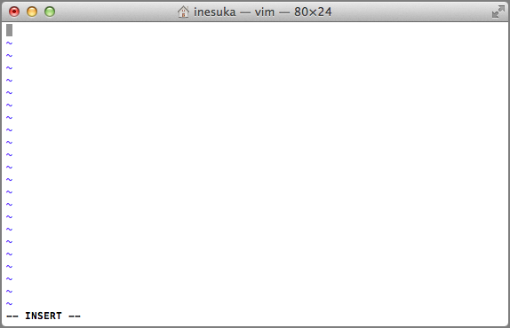
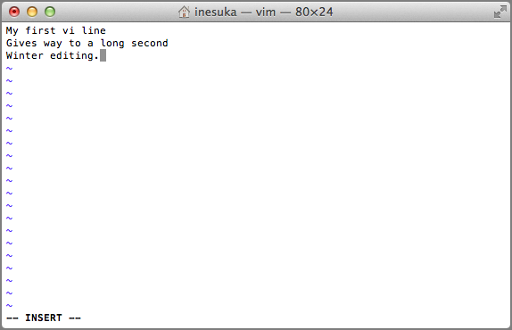
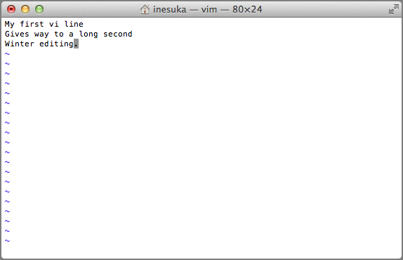
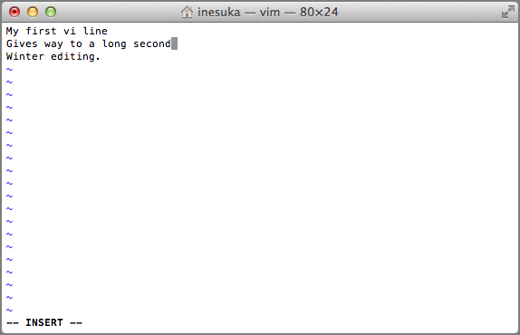
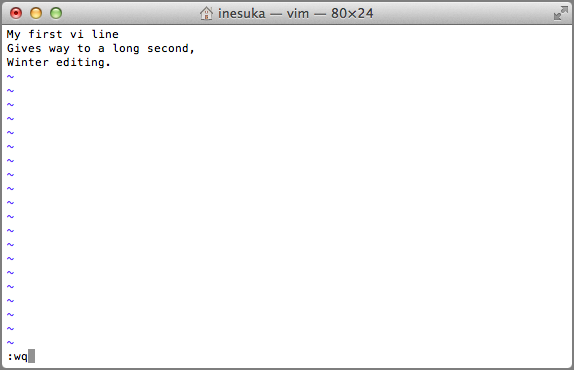
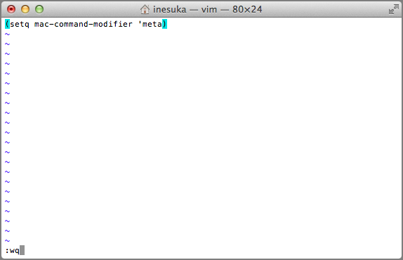
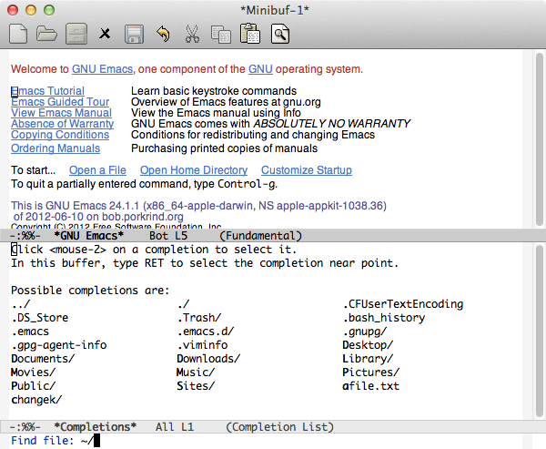
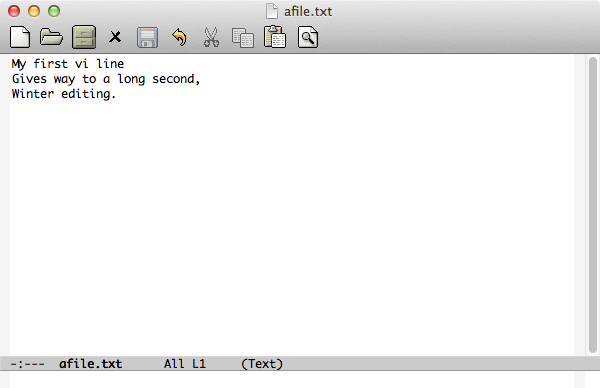
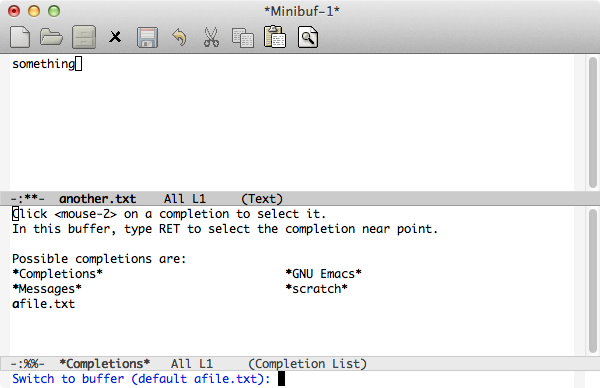
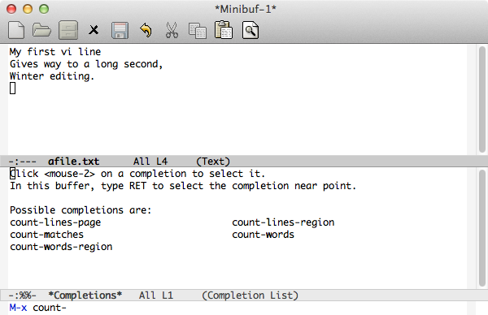

# §4 --- The way of the editor

Remember how we said that [everything is text](#L9365B629-17FA-4CFD-A473-A5528DEB75D7).  In plain text files you write programs, configure websites, select options for how to interact with many programs ---including the shell--- and store your data.

Let's look at the text editors, the programs designed to create and modify text files.  Two stand out among the many available: Vi and Emacs.  Which one is better is subject to much controversy, but don't pay too much heed to it.  You should be familiar with both before deciding which one is best for you.  I find both are useful in different contexts.

Vi is smaller than Emacs (seven times smaller in my system) and it is ubiquitous.  Whenever you log into a UNIX machine (including a Mac and a Raspberry Pi) you know that Vi will be available.  You'll most likely end up using Vi to edit configuration files in remote machines, for example your web server.

Emacs is bigger, but infinitely configurable.  I find it more convenient for most editing, and some of its editing modes (like [orgmode](http://orgmode.org)) are awesome.  Emacs is what I am using to write this, and the program where I spend most of my time at the computer.

{#L5F4A0549-A88D-4784-BE17-8E1EF743BE98}
## Editing with Vi

Vi is a direct descendant of the line editing program ed ([check it out](http://en.wikipedia.org/wiki/Ed_(text_editor)); it is also in your computer).  It acquired more or less its current form in 1976, and it is available pretty much everywhere.  Many programmers use it for all their editing.

It has two modes: normal mode, in which it will interpret the keys that you type as commands, and input mode, in which what you type becomes part of the file you are writing to.  By typing `i` in normal mode you move into input mode; by pressing the escape keyboard in input mode you move back to normal mode.

Try it out.  Open the terminal, and type

A> {linenos=off}
A> ~~~~~~~~
A> vi afile.txt
A> ~~~~~~~~

to create and edit the file `afile.txt`.  You should see something like this:

Note the `~` in the lines under the cursor, marking them as not yet part of the file (which now has zero lines).  Press `i` to enter input mode.  You'll get an indication at the bottom left of the screen:

Whatever you type now will become part of the file.  Try it out.  For example:

After are done adding text press escape to go back to normal mode:

You may now go back to input mode by pressing `i`.  Or, if you want to start the input one location to the right, press `a`.  Try it, see what happens, then escape again.

### Moving around

In normal mode the input is interpreted as commands.  You'll want to remember some of the more useful ones.  For example, you go back to the previous line with `k`, and forward to the next line with `j`.  With `b` you move back one word, with `w` move forward one word. With `h` move back one character, `l` move forward one character.  A `^` will move to the beginning of the line, and a `$` to the end.  A `G` will take you to the end of the file.

(The classic Vi and Emacs commands appear in many places.  For example, if you enable keyboard shortcuts in gmail you can move to the previous mail with a `k`, and to the next with a `j`.)

Don't be concerned about it being cryptic or hard to remember.  Just try it out a bit, play around, maybe write it down; it will soon enough become second nature.  Remember that, like many of the things we are talking about, you are after building muscle memory.

Let's try something else.  Say you want to add a comma at the end of the second line.  Type `k` or `j` until you are there, and then press `A`.  This will enter input mode placing the cursor at the end of the current line.

Type the comma, then back to normal mode with escape.

### Deleting, replacing and pasting

The `x` in normal mode will delete the character over the cursor.  A `dw` deletes to the end of the word, a `d$` to the end of the line (see the relationship with the movement commands?).  A `dd` will delete the whole line.

To paste what you just deleted press `p`.  You can, for example, delete a word with `dw`, then move somewhere else, then paste it there with `p`.

To replace a word type `cw`, then escape to go back to normal mode when you are done.  Can you guess what will replace the text from the current position to the end of the line?  To replace a single character press `r`, then the new character.

A dot `.` will repeat the last command; this gives you a rather convenient way to delete several words, for example.  But if you know how many words (or characters, or whatever) you want to delete, just type the number before the command.  So `3x` will delete three characters, and `200dd` will delete 200 lines.  Remember that you can paste them back just pressing `p`.

Do experiment a bit; with `u` you will undo your last command.

### Search

Press `/` in normal mode, and you'll be taken to the bottom of the screen.  Type whatever you want to search, followed by enter.  If you want your search to be case insensitive add a `\c` and the end of it.  Press `n` to repeat the search.

Remember that `^` was beginning of line, and `$` end of line?  For bonus points, try adding `^` and `$` to your searches.  For example, `/e$` will find an `e` at the end of a line.

### A third mode

Press `:` when in normal mode: the cursor will move to the line at the bottom of the screen, where you can type further commands.  For example, `:redo` will undo the last undo.  A number after the colon will be understood as a line number to move to; so `:10` will take you to the tenth line.

### Save and exit

Type `:w` to save to disk, and `:q` to exit.  If you want to save and exit type `:wq`,

If you want to exit without saving (losing your changes) do `:q!`.

Now let's make sure that we have indeed created the file,

{lang="sh"}
~~~~~~~~
ls afile.txt
~~~~~~~~

A> {linenos=off}
A> ~~~~~~~~
A> ls: afile.txt: No such file or directory
A> ~~~~~~~~

Indeed.  Let's look at its contents,

{lang="sh"}
~~~~~~~~
cat afile.txt
~~~~~~~~

A> {linenos=off}
A> ~~~~~~~~
A> cat: afile.txt: No such file or directory
A> ~~~~~~~~

With what you know now you can handle most of your editing needs, both in your computer and in remote servers.  Try it out, practice, play with Vi.  And you don't need to keep reading this chapter: I cannot resist introducing you to Emacs, but at this stage it will not solve you any problem that you can't solve with Vi.

{#L7CF53D87-8E5D-461E-BB92-BCDD8F528FC4}
## Editing with Emacs

Emacs is an altogether different beast.  Its first version was written in 1976 by Richard Stallman, whom we encountered in the previous chapter, and Guy L. Steele, Jr., whom you will encounter again if you ever venture into the fascinating topic of Lisp programming.

There are two things about Emacs that make it unique: it is a programmable editor, and it is self-documenting.  We mentioned before that we want to have a [conversation with the computer](#LB0F001FB-052A-4490-9098-167A152DD271): Emacs goes [out of its way](#L5D6DC20B-36ED-407D-B3B9-6E7A94420541) to facilitate the conversation.  More on that later.

Being programmable means that it can be made to do all sorts of things.  People have written extensions that allow it to read email, manage your todo list, read news, browse the web, use twitter, and pretty much everything you can think it would be cool to be able to do from the comfort of your own editor.  If you end up being an Emacs user you will probably learn Emacs Lisp, the dialect of the Lisp programming language that Emacs understands.

### Notation

Emacs makes heavy use of the modifier keys.  Let's review them and the notation that we'll use: there are two, control and meta.  Control is easy, as you've got a control key in your keyboard (even though I find it more convenient not to use it, and I re-map my keyboard so that the caps-lock key acts as control.  But don't get there yet, it will spoil you for ever).  We use a capital `C` to indicate control, so that `C-n` means press control, and then press `n` while holding control pressed.

We use a capital `M` to indicate meta.  In a Linux computer like the Raspberry Pi the Alt key is understood as meta, so `M-b` means press the Alt key, and while holding it press `b`.  Another way to do meta is by pressing the escape key *before* the key you want to modify: `M-b` can also be typed as escape, then `b`.  This is very inconvenient, and I only mention it because it will be the only way available in some computers.

### Configuring Emacs in your Mac

If you have a Mac you need some preparation before being able to use a decent version of Emacs.  Your best bet is to download from <http://emacsformacosx.com>, and install by opening the `.dmg` file, and copying the application to your Applications folder.

And now let's do something a bit unconventional, but that will provide you with some good practice.  Let's use Vi to customize Emacs a bit.  Like many UNIX programs (including Vi) Emacs tries to find and process a specific file every time you start it.  If it finds a file called `.emacs` in your home directory ---note the dot before the name, which will make it a hidden file--- it opens it, and it executes whatever Emacs Lisp instructions it contains.  When you've been using Emacs for a while you end up with plenty of stuff there, things that make Emacs behave just the way you want.  My `.emacs` file has 864 lines.  Which means it's probably time to clean it up.

Lets start your Emacs initialization file.  Open the terminal, make sure that you are in your home directory,

A> {linenos=off}
A> ~~~~~~~~
A> cd
A> ~~~~~~~~

and create your `.emacs` file opening it with Vi,

A> {linenos=off}
A> ~~~~~~~~
A> vi .emacs
A> ~~~~~~~~

Press `i` to start insert mode, and type

A> {linenos=off}
A> ~~~~~~~~
A> (setq mac-command-modifier 'meta)
A> ~~~~~~~~

Escape to go back to normal mode, and `:wq` to save and exit,

Make sure that you open and close the parentheses, because Lisp needs them.  When Emacs starts it will read your `.emacs` file, and it will assign (`setq`) the value `meta` to a variable named `mac-command-modifier`.  This is a very common pattern: Emacs knows about many variables, with more or less descriptive names, and it looks at their values when deciding how to behave.

By storing the `meta` value in the `mac-command-modifier` variable we are asking Emacs to use the Command key in your keyboard as the meta.  If you look at your keyboard you'll notice that the Command key is closer to the space bar than the Alt key, and easier to reach with your thumbs, which will make your work easier on your hands.  This might sound like a trivial eccentricity.  Maybe it is, but it does point to something important: when you spend several hours a day interacting with your computer ---as I spend many hours a day talking to Emacs--- small things matter, and end up making a difference in the long run.  Do invest in making your work environment as painless and comfortable as possible.

### More Emacs configuration options

Here are some other things you should add to your `.emacs` file:

{lang="elisp"}
~~~~~~~~
;;; Try to make sure that tabs are four spaces.
(setq tab-width 4
      indent-tabs-mode nil)
(setq-default indent-tabs-mode nil)

;;; We want M-g to run the goto-line function.
(global-set-key "\M-g" 'goto-line)

;;; Highlight matching parentheses
(show-paren-mode t)

;;; Whenever an external process changes a file underneath emacs, and
;;; there was no unsaved changes in the corresponding buffer, just
;;; revert its content to reflect what's on-disk.
(global-auto-revert-mode 1)

;;; This might not be required.  It instructs Emacs to look for files
;;; in your home directory by default.
(setq command-line-default-directory "~/")
~~~~~~~~

### Starting Emacs

Go ahead and open Emacs.  You should see something like this:

The initial screen tells you a couple of important things: first, that in order to cancel whatever you are doing in Emacs you need to press `C-g` (that is, hold control and press `g`.)  Second, that there is a tutorial available within Emacs.  It is very much advisable to follow it at least once.

### Opening a file and moving around

Press `C-x C-f` ---that is, `x` and then `f` while holding control--- and Emacs will ask you for the name of the file to open.  Try pressing tab twice instead of typing the file name directly, and you should see something similar to this:

Emacs is showing you all the possible completions of files to open in the current directory, and highlighting the letters it would make sense for you to type now.  Press `a`, the first letter of the `afile.txt` file we intend to visit, then tab again.  Emacs will fill in the file name for you; press enter, and you'll find yourself editing the file.

Of course you didn't have to do the tab-tab thing: you could have just typed the file name, enter, and you'd been done.  But saving keystrokes is a good thing, and it minimizes errors.

There you are.  You can now forget that this is Emacs and edit as you would in any other editor: move around with the arrows in the keyboard, delete with the delete key, insert text just by typing.  You don't really need to know the Emacs way to move around, but it will make you faster.  Plus, once you know it, you'll find everywhere.

To move forward one character press `C-f`; backward, `C-b`.  To go to the end of the line press `C-e`; to go to the beginning press `C-a`.  With `C-p` moves you a line up, and `C-n` a line down.  Move back a word with `M-b`, forward a word with `M-f`.

### Working with several files

Try opening another file: `C-x C-f`, then type `another.txt`, enter.  Type something on it.

You have now two open files.  Emacs calls them buffers, and lets you jump between as many of them as you want in a rather convenient way.  Press `C-x b` (the `b` without the control, remember), and you'll get asked what buffer you want to visit.  Press tab twice, to see you options:

As when you were opening a file, as soon as you have typed the minimum number of letters that allows Emacs to distinguish between two buffers you can press tab again, and the buffer name will be filled in for you. Press enter, and you'll be taken to the buffer you pick.

### Search

To search in the current buffer press `C-s`.  If you press it twice it will try the previous search again; pressing it only once it will prompt you for a text to search.  As you start typing the search will start.  Try it out.  If you want to search backwards instead of forward press `C-r` (remember how you [searched](#LB65C9D4E-2689-41B8-899D-7AAD5EE86171) your command line history?).

{#L5D6DC20B-36ED-407D-B3B9-6E7A94420541}
### Talking to Emacs

When you press `M-x` Emacs will take you to the line at the bottom, called minibuffer.  There you can start typing a command, and Emacs will help you fill it in.  Pretty much everything that Emacs can do is a function ---a command--- with a descriptive name, and you can call them after the `M-x`.  Try, for example, `M-x count-words`, then enter.  As before, don't type everything.  After the `M-x co` a tab will fill up until `count-`; a couple more tabs will show you the options:

Other functions you'll be using include `M-x replace-string`, `M-x describe-variable`,  and `M-x describe-function`.

### Undo

Many functions are also accessible with more or less intricate keyboard combinations.   For example, you can undo with `M-x undo`, but nobody does that; the function is bound to `C-_` (you'll need to hold shift for this one).  Undo in Emacs is quite convenient: if you keep pressing `C-_` it will take you back in history.  If at any point you stop, for example by moving to the next character with `C-f`, the undo will be reversed in time, and it will start re-doing.

### Copy and paste

To delete a word press `M-w`.  Delete a line with `C-k`, and a character with `C-d`.  To delete an arbitrary text move to the beginning, mark it with `C-space`, then move to the end, and delete with `C-w`.  If you want to copy from the mark use `M-w` instead.  To paste what you last deleted press `C-y`.  If you press `M-y` just after pasting with `C-y` it will replace the pasted text with the one you deleted before last; keep pressing `M-y`, and you'll paste texts deleted further back in your editing history.

{#L1FBA41B9-A257-455C-9311-DCF46565AE90}
### Asking Emacs for help

Emacs proudly calls itself "an extensible self-documenting editor."  You may ask Emacs for help in many ways:

-   With `C-h k` provides help about a command.  Incidentally, this is the only place I know within Emacs where `C-g` does not cancel what you are doing: instead, it displays the available help for `C-c`.

-   You may ask about a work that might be part of a command or variable with `M-x apropos`.

-   With `M-x describe-variable` you get the documentation of a variable.  With `M-x describe-function` you get the documentation of a function.

### Save and exit

To save the current buffer type `C-x C-s`.  To save all unsaved buffers type `C-x s`.  You should get into the habit of pressing `C-x C-s` quite often.  It becomes automatic; after writing a bunch of lines the left hand does `C-x C-s` almost by itself.

To exit Emacs type `C-x C-c`.

{#L75BD9720-06CA-4958-9393-8B4D46E72110}
## Programs are text files ---and documents can be as well

Programs are written as plain text files.  But not only programs: you can, and probably should, write your documents and papers in them as well.  Provided that you follow a set of conventions (a language), the [LaTeX](http://www.latex-project.org) typesetting system will take care of producing beautifully formatted PDF documents from text files.  It is what most physicists and mathematicians use, and it works surprisingly well.  So well that you can usually spot a document written in LaTeX because it looks so good.  And the formulas are brilliant.  For example, if you want this in your document

{$$}
\sum_{n=1}^\infty \frac{1}{n^2} = \frac{\pi^2}{6}
{/$$}

you only have to write

A> {linenos=off}
A> ~~~~~~~~
A> \sum_{n=1}^\infty \frac{1}{n^2} = \frac{\pi^2}{6}
A> ~~~~~~~~

in your text file.  Which might look daunting at first sight, but I think you'll be able to understand it if you look at it carefully.  Most importantly, ten years from now you'll still be able to read it and understand it and, being as it is the *de facto* standard for typesetting math, there'll be plenty of programs around who'll be able to render it into a good looking formula.

LaTeX is a classic program: it was written in 1985 by Leslie Lamport on top of TeX, which was itself developed back in 1978 by [Donald E. Knuth](http://www-cs-faculty.stanford.edu/~knuth/), another hero among programmers.  But the idea behind it ---write text, include in the text information about its structure, and get a program to convert it to something printer-ready for you--- was first implemented in [roff](http://en.wikipedia.org/wiki/Roff) back in the sixties.  And yes, you have a version of it in your computer: its modern self is called troff.

So, am I advocating that you stop using Word, and start using a text editor to produce text files that some program written in 1978 will convert to something neat?  Yes I am.  Plus you'll be encoding your information in plain old ASCII, which is something that's been around and stable since the sixties and, given that all computers rely on it, will be around in the foreseeable future.

Let me give you a small piece of personal trivia.  When I finished my engineering degree, back in 1994, I spent several months writing my master's thesis.  I used Amipro, a then mighty word processor that was competing with Word.  But Amipro lost, and it pretty much disappeared.  By 1998, when I started writing my PhD thesis, I did not have a way to read my master's thesis.  Luckily by then I knew about LaTeX, and wrote my PhD thesis with it.  I can still read it, and produce a pretty PDF from it, 16 years later. If you care about the permanence of your data store it in plain text.

{#L635159D4-672C-41F2-B10F-3FBD7E68992B}
## Why bother

We've only scratched the surface of both Vi and Emacs; there's plenty to know, and plenty to do.  And you might be wondering, why bother?  Why so much complexity, so many options, so many functions?  The answer is that we want to save time, we want to save keystrokes, we don't want to touch the mouse ---it is awfully inefficient--- and we want to be able to tell the computer to do what computers are good at doing.

One day you realize that there's something you do all the time when hacking away at your editor, and could be done better.  For example, you take your right hand all the way to the arrows ---ouch!--- to move the cursor.  And you think, wouldn't it be better if I could move around without moving my hands?  And then you teach your hands to do `C-p` and `C-n` if in Emacs, or `k` and `j` if in Vi.

As you progress you'll find more sophisticated things that you'll want done more efficiently, and some googling will teach you that somebody's had your problem and solved it already--- you are not alone.  And then, further down the line, you start writing your own functions to solve the problems that, incredibly, nobody's realized yet that need solving.

